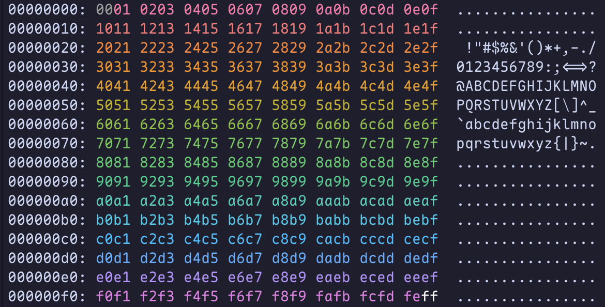

# zzd

An opinionated port of xxd to zig




## How to build

```bash
zig build-exe --name zzd -O ReleaseFast main.zig
```

## How to use

```bash
# -i for inverted color mode
zzd [-i] <filename>
```

Respects `NO_COLOR=1`.
